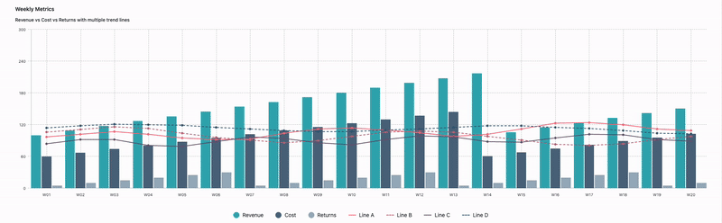
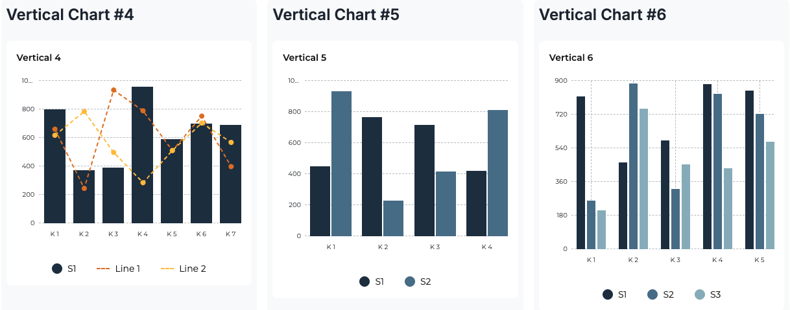
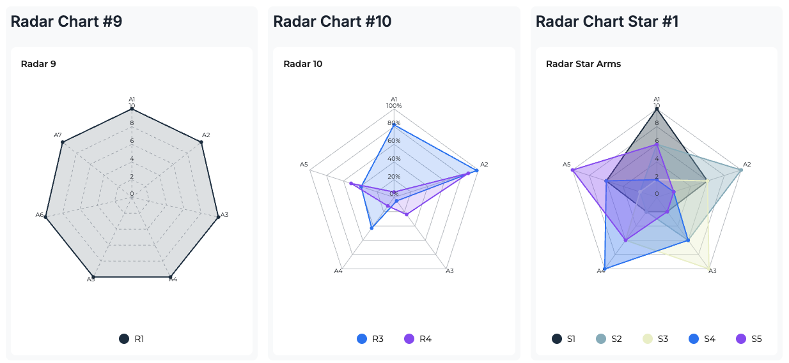
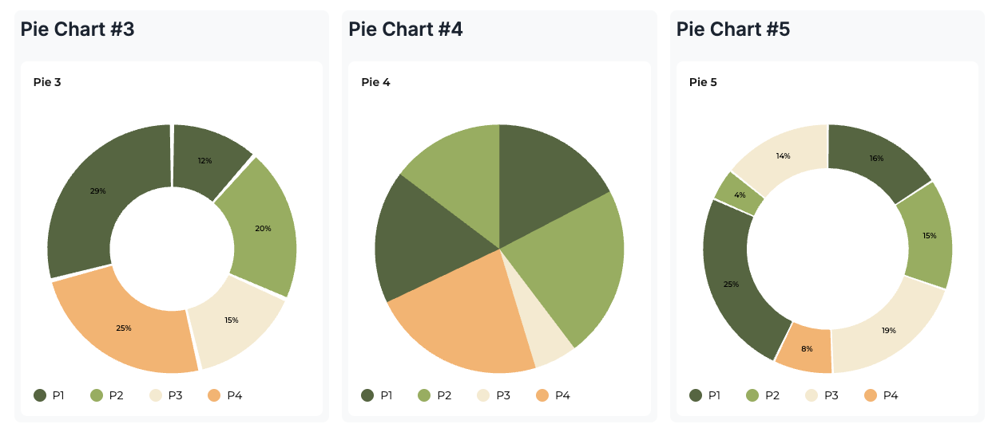
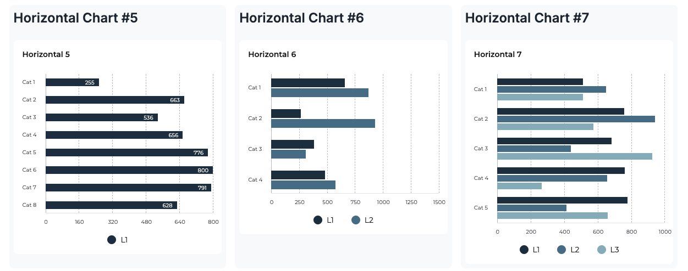

# React Chart Lite


**Lightweight, style-agnostic chart components for React 18/19**

<p align="center">
  
  <br/>
  
   <br/>
  
   <br/>
  
   <br/>
  
</p>

React Chart Lite provides a modern, minimalist approach to data visualization with zero dependencies and complete customization control. Built with performance and accessibility in mind, it delivers beautiful charts without compromising on bundle size.

---

## ✨ Features

- **🪶 Ultra Lightweight** - Zero dependencies except React
- **⚡ Performance First** - Optimized rendering with tree-shakable exports
- **🎨 Fully Customizable** - CSS Modules, custom properties, and unstyled variants
- **♿ Accessible by Design** - WCAG compliant with keyboard and screen reader support
- **📱 Responsive** - Mobile-friendly with touch interactions
- **🔧 TypeScript** - Full type safety with comprehensive interfaces
- **🚀 Modern React** - Support for React 18/19 with client-side rendering

## 📊 Chart Types

<table>
  <tr>
    <td align="center">
      <strong>Horizontal Bar</strong><br/>
      
    </td>
    <td align="center">
      <strong>Vertical Bar</strong><br/>
      
    </td>
  </tr>
  <tr>
    <td align="center">
      <strong>Pie Chart</strong><br/>
      
    </td>
    <td align="center">
      <strong>Radar Chart</strong><br/>
      
    </td>
  </tr>
</table>

---

## 🚀 Quick Start

### Installation

```bash
npm install react-chart-lite
# or
yarn add react-chart-lite
# or  
pnpm add react-chart-lite
```

**Requirements:**
- React 18+ or React 19+
- Client-side rendering environment

### Basic Usage

```tsx
import { VerticalBarChart } from 'react-chart-lite';

const data = [
  { 
    category: 'January', 
    bars: [
      { label: 'Revenue', value: 4500, legendId: 'revenue' },
      { label: 'Expenses', value: 3200, legendId: 'expenses' }
    ]
  },
  { 
    category: 'February', 
    bars: [
      { label: 'Revenue', value: 5200, legendId: 'revenue' },
      { label: 'Expenses', value: 3800, legendId: 'expenses' }
    ]
  }
];

const legends = [
  { id: 'revenue', label: 'Revenue', color: '#10B981' },
  { id: 'expenses', label: 'Expenses', color: '#F59E0B' }
];

function MyChart() {
  return (
    <VerticalBarChart
      data={data}
      legends={legends}
      title="Monthly Financial Overview"
      showLegend
      showGrid
      showTooltip
    />
  );
}
```

---

## 📚 API Reference

### Components

#### `<HorizontalBarChart />`

A horizontal bar chart component for comparing values across categories.

**Props:**

| Property | Type | Default | Description |
|----------|------|---------|-------------|
| `data` | `ChartDataItem[]` | **required** | Chart data with categories and bars |
| `legends` | `ChartLegendItem[]` | **required** | Color and label definitions |
| `title` | `string` | `undefined` | Chart title |
| `subtitle` | `string` | `undefined` | Chart subtitle |
| `iconSrc` | `string` | `undefined` | Icon URL (44x44px) |
| `scale` | `ChartScale` | *auto-calculated* | X-axis scale configuration |
| `showLegend` | `boolean` | `true` | Display legend |
| `barHeight` | `number` | `30` | Individual bar height in pixels |
| `barSpacing` | `number` | `2` | Space between bars in same category |
| `categorySpacing` | `number` | `8` | Space between categories |
| `showGrid` | `boolean` | `true` | Show grid lines |
| `showVerticalGrid` | `boolean` | `true` | Show vertical grid lines |
| `showHorizontalGrid` | `boolean` | `false` | Show horizontal grid lines |
| `gridLineVariant` | `'solid' \| 'dashed' \| 'dotted'` | `'dashed'` | Grid line style |
| `showValues` | `boolean` | `false` | Display values on bars |
| `animated` | `boolean` | `true` | Enable animations |
| `animationDuration` | `number` | `500` | Animation duration in ms |
| `showTooltip` | `boolean` | `false` | Enable interactive tooltips |
| `onBarClick` | `(bar, categoryIndex, barIndex) => void` | `undefined` | Bar click handler |
| `unstyled` | `boolean` | `false` | Disable default styling |
| `classes` | `Record<string, string>` | `{}` | Custom CSS classes |

**Type Definitions:**

```typescript
interface ChartDataItem {
  category: string;
  bars: ChartBar[];
}

interface ChartBar {
  label: string;
  value: number;
  legendId: string;
  tooltip?: string;
}

interface ChartLegendItem {
  id: string;
  label: string;
  color: string;
}

interface ChartScale {
  min: number;
  max: number;
  intervals: number;
  formatter?: (value: number) => string;
}
```

#### `<VerticalBarChart />`

A vertical bar chart with optional line overlay functionality.

**Props:**

Includes all `HorizontalBarChart` props plus:

| Property | Type | Default | Description |
|----------|------|---------|-------------|
| `chartHeight` | `number` | `368` | Chart height in pixels |
| `showLine` | `boolean` | `false` | Enable line overlay |
| `lineSeries` | `VerticalBarChartLineSeries[]` | `[]` | Line series data |
| `lineWidth` | `number` | `2` | Line stroke width |
| `showLinePoints` | `boolean` | `true` | Show points on lines |
| `linePointRadius` | `number` | `4` | Line point radius |

**Additional Types:**

```typescript
interface VerticalBarChartLineSeries {
  values: number[];
  legendId: string;
  dashed?: boolean;
}
```

#### `<PieChart />`

A pie/donut chart for displaying proportional data.

**Props:**

| Property | Type | Default | Description |
|----------|------|---------|-------------|
| `data` | `PieChartDatum[]` | **required** | Pie slice data |
| `legends` | `ChartLegendItem[]` | **required** | Color and label definitions |
| `title` | `string` | `undefined` | Chart title |
| `subtitle` | `string` | `undefined` | Chart subtitle |
| `iconSrc` | `string` | `undefined` | Icon URL (44x44px) |
| `size` | `number` | `360` | Chart size in pixels |
| `innerRadiusRatio` | `number` | `0` | Inner radius ratio (0 = pie, >0 = donut) |
| `padAngle` | `number` | `0` | Gap between slices in degrees |
| `showLabels` | `boolean` | `true` | Show labels on slices |
| `labelFormatter` | `(percent, value, label) => string` | *default formatter* | Custom label formatter |
| `showLegend` | `boolean` | `true` | Display legend |
| `showTooltip` | `boolean` | `false` | Enable tooltips |
| `unstyled` | `boolean` | `false` | Disable default styling |
| `classes` | `Record<string, string>` | `{}` | Custom CSS classes |

**Type Definitions:**

```typescript
interface PieChartDatum {
  value: number;
  legendId: string;
}
```

#### `<RadarChart />`

A radar/spider chart for multi-dimensional data visualization.

**Props:**

| Property | Type | Default | Description |
|----------|------|---------|-------------|
| `axes` | `string[]` | **required** | Axis labels |
| `series` | `RadarChartSeries[]` | **required** | Data series |
| `legends` | `RadarChartLegendItem[]` | **required** | Color, label, and opacity definitions |
| `title` | `string` | `undefined` | Chart title |
| `subtitle` | `string` | `undefined` | Chart subtitle |
| `iconSrc` | `string` | `undefined` | Icon URL (44x44px) |
| `scale` | `RadarChartScale` | *auto-calculated* | Scale configuration |
| `size` | `number` | `360` | Chart size in pixels |
| `showGrid` | `boolean` | `true` | Show concentric grid |
| `showAxes` | `boolean` | `true` | Show axes lines |
| `showAxisLabels` | `boolean` | `true` | Show axis labels |
| `gridLineVariant` | `'solid' \| 'dashed' \| 'dotted'` | `'dashed'` | Grid line style |
| `dotRadius` | `number` | `3` | Data point radius |
| `strokeWidth` | `number` | `2` | Line stroke width |
| `fillOpacity` | `number` | `0.15` | Default fill opacity |
| `showLegend` | `boolean` | `true` | Display legend |
| `showTooltip` | `boolean` | `false` | Enable tooltips |
| `unstyled` | `boolean` | `false` | Disable default styling |
| `classes` | `Record<string, string>` | `{}` | Custom CSS classes |

**Type Definitions:**

```typescript
interface RadarChartSeries {
  values: number[];
  legendId: string;
}

interface RadarChartLegendItem {
  id: string;
  label: string;
  color: string;
  fillOpacity?: number;
}

interface RadarChartScale {
  min: number;
  max: number;
  intervals: number;
  formatter?: (value: number) => string;
}
```

---

## 🎨 Styling & Theming

### CSS Custom Properties

React Chart Lite uses CSS custom properties for easy theming:

```css
:root {
  --rcl-surface-bg: #ffffff;
  --rcl-font-family: ui-sans-serif, system-ui, sans-serif;
  --rcl-text-primary: #0f172a;
  --rcl-text-muted: #64748b;
  --rcl-grid-bottom-color: #e2e8f0;
  --rcl-border-color: #e5e7eb;
  --rcl-tooltip-bg: #111827;
  --rcl-tooltip-text: #f9fafb;
  --rcl-on-primary: #ffffff;
}

/* Dark theme example */
[data-theme="dark"] {
  --rcl-surface-bg: #0f172a;
  --rcl-text-primary: #f8fafc;
  --rcl-text-muted: #94a3b8;
  --rcl-grid-bottom-color: #334155;
  --rcl-border-color: #475569;
  --rcl-tooltip-bg: #f8fafc;
  --rcl-tooltip-text: #0f172a;
}
```

### Unstyled Components

Remove all default styles and provide your own:

```tsx
<VerticalBarChart
  data={data}
  legends={legends}
  unstyled
  classes={{
    root: 'my-chart-root',
    container: 'my-chart-container',
    bar: 'my-chart-bar',
    tooltip: 'my-tooltip'
  }}
/>
```

### CSS Modules Classes

Each component exposes specific class names for granular control:

**HorizontalBarChart:**
- `root`, `container`, `body`, `rows`, `row`, `rowLabel`, `rowBars`, `barWrapper`, `bar`, `barValue`, `tooltip`

**VerticalBarChart:**
- `root`, `container`, `body`, `columns`, `group`, `bar`, `barValue`, `xLabels`, `xLabel`, `lineLayer`, `tooltip`

**PieChart:**
- `root`, `container`, `square`, `svg`, `label`, `tooltip`

**RadarChart:**
- `root`, `container`, `svgWrap`, `square`, `svg`, `axisLabel`, `tooltip`

---

## 🔧 Advanced Usage

### Custom Scale with Formatter

```tsx
const scale = {
  min: 0,
  max: 100000,
  intervals: 5,
  formatter: (value) => `$${(value / 1000).toFixed(0)}k`
};

<VerticalBarChart
  data={salesData}
  legends={legends}
  scale={scale}
  showGrid
/>
```

### Line and Bar Combination

```tsx
const lineSeries = [
  { 
    legendId: 'target', 
    values: [5000, 6000, 5500, 7000], 
    dashed: true 
  },
  { 
    legendId: 'trend', 
    values: [4800, 5800, 6200, 6800], 
    dashed: false 
  }
];

<VerticalBarChart
  data={data}
  legends={legends}
  showLine
  lineSeries={lineSeries}
  lineWidth={3}
  showLinePoints
  linePointRadius={5}
/>
```

### Interactive Features

```tsx
function handleBarClick(bar, categoryIndex, barIndex) {
  console.log('Clicked:', { bar, categoryIndex, barIndex });
  // Custom logic here
}

<HorizontalBarChart
  data={data}
  legends={legends}
  onBarClick={handleBarClick}
  showTooltip
  animated
  animationDuration={800}
/>
```

### Donut Chart

```tsx
<PieChart
  data={pieData}
  legends={legends}
  innerRadiusRatio={0.6}
  padAngle={2}
  labelFormatter={(percent, value, label) => 
    percent > 5 ? `${label}\n${percent.toFixed(1)}%` : ''
  }
/>
```

---

## ♿ Accessibility

React Chart Lite follows WCAG guidelines:

- **Keyboard Navigation**: All interactive elements are keyboard accessible
- **Screen Readers**: Proper ARIA labels and semantic HTML structure
- **Color Independence**: Information isn't conveyed by color alone
- **Focus Management**: Clear focus indicators and logical tab order
- **Live Regions**: Dynamic content updates are announced

```tsx
// Accessibility features are enabled by default
<VerticalBarChart
  data={data}
  legends={legends}
  // Bars render as buttons with descriptive aria-labels
  // Tooltips use role="status" and aria-live="polite"
/>
```

---

## 📱 Examples

### Financial Dashboard

```tsx
import { HorizontalBarChart, VerticalBarChart, PieChart } from 'react-chart-lite';

function FinancialDashboard() {
  const revenueData = [
    { 
      category: 'Q1 2024', 
      bars: [
        { label: 'Revenue', value: 125000, legendId: 'revenue' },
        { label: 'Target', value: 120000, legendId: 'target' }
      ]
    }
    // ... more quarters
  ];

  const expenseBreakdown = [
    { value: 45000, legendId: 'salaries' },
    { value: 12000, legendId: 'marketing' },
    { value: 8000, legendId: 'operations' },
    { value: 5000, legendId: 'other' }
  ];

  return (
    <div className="dashboard">
      <VerticalBarChart
        data={revenueData}
        legends={revenueLegends}
        title="Quarterly Revenue vs Target"
        showLegend
        showGrid
        showTooltip
        scale={{ min: 0, max: 150000, intervals: 6, formatter: (v) => `$${v/1000}k` }}
      />
      
      <PieChart
        data={expenseBreakdown}
        legends={expenseLegends}
        title="Expense Breakdown"
        innerRadiusRatio={0.4}
        showLabels
        showTooltip
      />
    </div>
  );
}
```

### Performance Metrics

```tsx
function PerformanceRadar() {
  const metrics = ['Speed', 'Reliability', 'Security', 'Usability', 'Scalability'];
  
  const series = [
    { legendId: 'current', values: [8, 9, 7, 8, 6] },
    { legendId: 'target', values: [9, 9, 9, 9, 8] }
  ];

  return (
    <RadarChart
      axes={metrics}
      series={series}
      legends={performanceLegends}
      title="System Performance Metrics"
      showGrid
      showAxisLabels
      scale={{ min: 0, max: 10, intervals: 5 }}
    />
  );
}
```

---

## 🛠️ Development

### Local Development

```bash
# Clone the repository
git clone https://github.com/omerfarukgurbuz/react-chart-lite.git

# Install dependencies
cd react-chart-lite
npm install

# Setup example app dependencies (one-time)
npm run setup:examples

# Run example app (from project root)
npm run dev:examples

# Alternatively, run the example directly
cd examples/demo-vite
npm install && npm run dev
```

### Building

```bash
# Build the library
npm run build

# Run tests
npm test

# Type checking
npm run type-check
```

---

## 📦 Bundle Size

React Chart Lite is optimized for minimal bundle impact:

- **Gzipped**: ~12KB
- **Tree-shakable**: Import only what you need
- **Zero dependencies**: No third-party bloat
- **CSS Modules**: Scoped styles with minimal runtime

---

## 🤝 Contributing

We welcome contributions! Please see our [Contributing Guide](CONTRIBUTING.md) for details.

### Development Guidelines

- Follow the existing code style
- Add tests for new features
- Update documentation
- Ensure accessibility compliance

---

## 📄 License

MIT © [Ömer Faruk Gürbüz](https://github.com/omerfarukgurbuz)

---

## 🔗 Links

- [Documentation](https://github.com/omerfarukgurbuz/react-chart-lite)
- [Examples](https://github.com/omerfarukgurbuz/react-chart-lite/tree/main/examples)
- [Changelog](CHANGELOG.md)
- [Issues](https://github.com/omerfarukgurbuz/react-chart-lite/issues)
- [NPM Package](https://www.npmjs.com/package/react-chart-lite)
